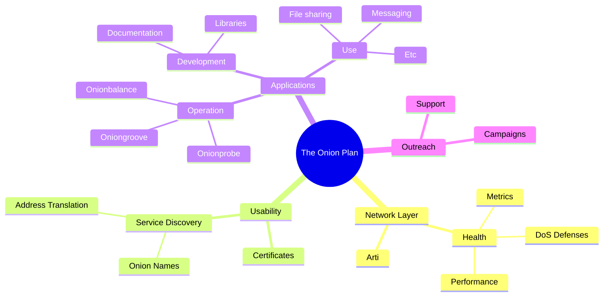
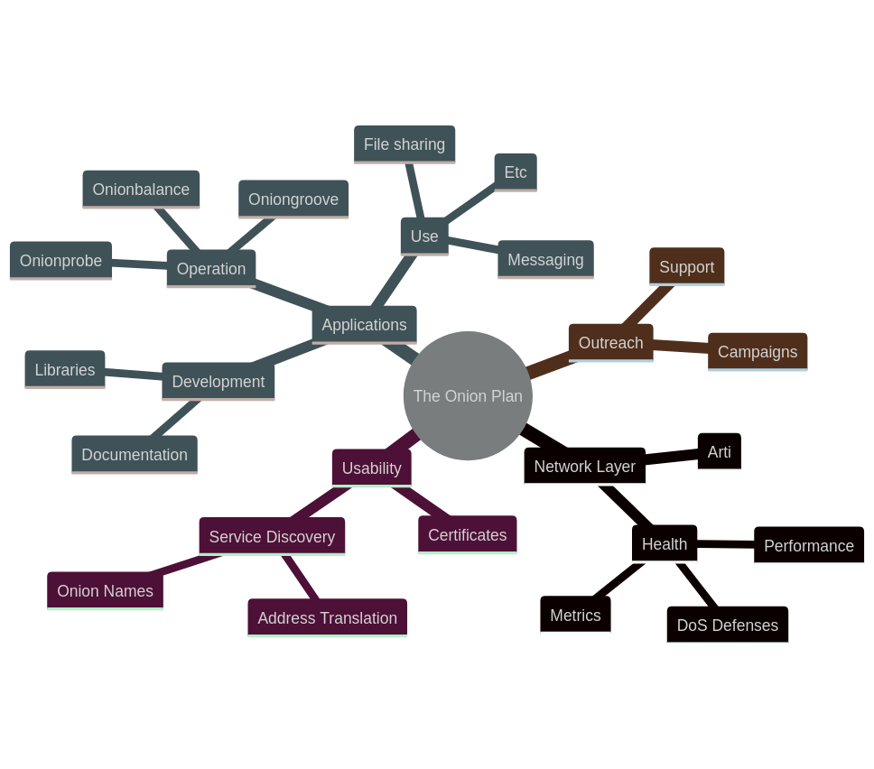

# The Onion Plan research

* For an overview of the Onion Plan, check the [presentation held at the 2022 Tor
  Meeting][] and the [originating ticket][].

* The Onion Plan repository is hosted at [https://gitlab.torproject.org/tpo/onion-services/onionplan][].

[presentation held at the 2022 Tor Meeting]: https://gitlab.torproject.org/tpo/team/-/wikis/202209MeetingOnionPlan
[originating ticket]: https://gitlab.torproject.org/tpo/onion-services/onion-support/-/issues/135
[https://gitlab.torproject.org/tpo/onion-services/onionplan]: https://gitlab.torproject.org/tpo/onion-services/onionplan

## Goals

1. Provide a detailed overview of existing proposals and challenges involved in
   increasing the usability of [Onion Services][].
2. Discuss possible scenarios and pathways towards the implementation of
   new and existing proposals.
3. Aid discussion and decision making.

[Onion Services]: https://community.torproject.org/onion-services/

## Structure

This research has the following major sections:

1. **Proposals**: an inventory on all ideas an existing research on _enhancement
   proposals_.
2. **Scenarios**: where some of the enhancement proposals are selected and
   arranged in development phases inside _roadmap scenarios_.
3. **Appendixes**: in-depth discussion of proposals and scenarios.

The overall plan is also split into research tracks that may be worked by
distinct, integrated teams:

1. Network Layer: DoS protections, performance improvements etc.
2. Usability: Onion Names, Tor Browser improvements etc.
3. Applications: softwares and libraries for using Onion Services technology.
4. Outreach: documentation, support, usage/adoption campaigns etc.

Fundraising projects can integrate all or some of these items by proposing an
***Onion Service Enhancement Package***.

<!-- Not supported yet by Onion MkDocs -->
<!--

-->

## Terminology

This research relies on specific [Terminology][] about [Onion Services][]

[Terminology]: https://gitlab.torproject.org/tpo/onion-services/onion-support/-/wikis/Documentation/Terminology
